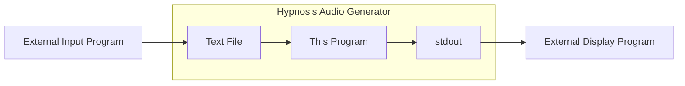

# Dynamic Hypnosis Audio Generator
🔞 **This program is only intended for use by those aged 18+**

A program that dynamically generates repeating hypnosis audio, complete with sound effects and multi-layered audio, using text-to-speech.

## Features
- **Automatic Text-to-Speech**: Converts text lines from a file into audio.
- **Dynamic Audio Generation**: Combines multiple audio layers, including background tones and echo effects.
- **Live Updating Audio**: Updating the source text file changes the lines in the generated audio without needing to restart the application.
- **Display Current Line**: The program prints the currently playing line to the terminal, allowing you or others to see what the user is currently hearing.

## Table of Contents
1. [Requirements](#requirements)
2. [Installation](#installation)
3. [Setting up a Hypno Scene](#setting-up-a-hypno-scene)
4. [Running the Program](#running-the-program)
5. [Notes to Be Aware Of](#notes-to-be-aware-of)
6. [Advanced Usage](#advanced-usage)
7. [Known Issues](#known-issues)

## Requirements
- [Python 3.13](https://www.python.org/downloads/release/python-313/).
- **Windows Only**:
  - [Microsoft Visual C++ Redistributable](https://learn.microsoft.com/en-us/cpp/windows/latest-supported-vc-redist) - required for audio effects. Ensure you download the right version for your system architecture.
- **Optional**:
  - [uv](https://docs.astral.sh/uv/) - to simplify dependency management and running the program, or pip if you prefer (see [installation notes](#installation) below).
- Pretty decent system resources - unsure of exact requirements, but it can be resource-intensive to generate audio and apply the effects in real-time.

## Installation
I strongly recommend using [uv](https://docs.astral.sh/uv/), which will simplify installing Python if you don't have it, as well as setting up dependencies and running the program, though you can also use `pip` if you prefer.

### Using `uv`
1. Clone or download the respository
2. Open a terminal in the project directory
3. Run the following command to install dependencies (this will also automatically install Python 3.13 if you don't have it):
    ```bash
    uv sync
    ```

### Using `pip`
1. Clone or download the repository
2. Open a terminal in the project directory
3. Create a virtual environment (optional but recommended):
    ```bash
    python3 -m venv .venv
    ```
    **Note**: On Windows, you may need to use `python` or `py` instead of `python3`, depending on your setup.
4. Activate the virtual environment:
    - On MacOS/Linux:
      ```bash
      source .venv/bin/activate
      ```
    - On Windows:
      ```bash
      .venv\Scripts\activate
      ```
5. Run the following command to install dependencies:
    ```bash
    pip install -r requirements.txt
    ```

### Choosing a Text to Speech Voice
The audio generated will automatically use your **system's default text-to-speech voice**.

#### MacOS
1. Go to **System Settings** > **Accessibility** > **Spoken Content**.
2. Under **System Voice**, select your preferred voice. You can press the ℹ️ icon to hear a sample of the voice or choose a different one from the list.

#### Windows 11
1. Search for "Text to Speech" in the Start menu - you want the option that opens in the old Control Panel.
2. Under **Voice Selection**, choose your preferred voice from the dropdown menu. You can click the **Preview Voice** button to hear a sample.

To install a new voice:
1. Go to **Settings** > **Time & Language** > **Speech**.
2. Under **Manage voices**, click **Add voices**.
3. Select the voice you want to install and click **Add**.
4. You may need to restart your computer for the new voice to be available, then follow the steps above to select it as your default voice.

#### Linux
I have not tested this on Linux, but the text to speech functionality uses espeak, which should be available on most distributions. You can install it using your package manager (e.g., `sudo apt install espeak` on Debian-based systems).

## Setting up a Hypno Scene
When running the program, it checks for and uses the following:
- **Text File**: The hypnosis lines to be read.
- **Config File**: Settings for the audio generation, such as background sound, echo effects and delay.
- **(Optional) Mantra File**: An additional audio file that can be played repeatedly in the background.

### Text File
The text file should contain the hypnosis lines you want to be read. By default the program looks at the file called `lines.txt` in the root folder. Simply edit this file to change the hypnosis lines.

Also note that the program will automatically update the audio if you change the text file while it is running, so you can edit the lines in real-time.

You can specify a different text file by passing the `-t <text_filepath>` argument when running the program. See the [Running the Program](#running-the-program) section for details on how to do this.

### Config File
The config file is a JSON file that contains various settings for the audio generation. By default, it is located in `config.json` in the project root, and contains all the default settings. The following options are available:

| Setting | Description | Available Options | Default |
|:--------|:------------|:------------------|:--------|
| `background_audio` | Type of background audio to play | `tone` - A binaural tone with a 1 second wave that shifts between left and right speakers/headphones.<br><br>`noise` - Brown noise.<br><br>`none` - No background audio. | `tone` |
| `line_chooser` | Method for selecting hypnosis lines | `sequential` - The lines in the text file will always be played in order from top to bottom. If the text file is updated, the changes will not be heard until the current loop through all the existing lines finishes.<br><br>`sequential_refreshing` - Lines will always play in order, but if the text file changes, playback will **immediately** start from top to bottom of the new version of the file.<br><br>`shuffled` - The order of the lines will be shuffled and played in a random order. Once all the lines have been played, the order is shuffled again, and so on. If the text file is updated, the changes will not be heard until the current loop through all the existing lines finishes. <br><br>`random` - A line will be chosen at random every time, though repeating the same line twice in a row is avoided. Updating the text file immediately updates the available lines to randomly select from. | `sequential` |
| `initial_line_delay` | Delay in seconds before starting to play lines<br><br>**Note**: This will be ignored if the `background_audio` is set to `none` - Hypnosis line playback will begin immediately in this case. | Any positive number | `15.0` |
| `initial_pitch_shift` | Initial pitch shift for the audio lines, in semitones.<br><br>Use this to set the voice to sound higher (positive number) or lower (negative number) in pitch than your system's text-to-speech voice. | Any number | `-1.44` |
| `max_echoes` | Maximum number of echoes to play for each line<br><br>Each echo is a delayed repetition of the original line, with the delay specified by `echo_delay`. Each echo is lower in pitch and quieter than the last. | `0` to `3` (inclusive) | `2` |
| `echo_delay` | Delay in seconds between echoes. | Any positive number | `1.5` |
| `mantra_filepath` | Path to mantra audio file, or `none` for no mantra | Any valid file path or `none` | `./import/mantras/relax_sink_enjoy.mp3` |
| `mantra_start_delay` | Delay in seconds after hypnosis line playback begins, before starting mantra playback<br><br>**Note**: This will be ignored if the `mantra_filepath` is set to `none` - Mantra playback will not occur in this case. | Any positive number | `45.0` |

### Mantra File
The mantra file is an audio file that can be played repeatedly in the background while the hypnosis lines are being read. It typically consists of a few repeating words that fade in and out. It starts playing after the background tone and main hypnosis lines have started playing, and continues to play until the program is stopped.

A basic example is included in `./import/mantras`, and I've made some sample files available in my [Google Drive](https://drive.google.com/drive/folders/1Uv9Og_GMYDpb2TKv_IzRYOutmHBePzaW?usp=sharing) for use with this program.

Make sure to set the `mantra_filepath` in the config file to the path of the mantra audio file you want to use, or set it to `none` if you don't want to use a mantra.

> **How Do I Make My Own Mantra File?**
> Unfortunately, it's not possible to also generate the background mantra text and effects in real time. I made a guide on [how I make my own mantra files](https://s10boi.blogspot.com/2024/03/how-i-make-hypno-programs.html), which uses my other hypno generation program, available [here](https://github.com/s10boi/hypno_audio_generator)

## Running the Program
As with installation, I recommend using [uv](https://docs.astral.sh/uv/) to run the program, but you can also use `pip` if you prefer.

### Using `uv`
1. Open a terminal in the project directory.
2. Run the following command to start the program:
    ```bash
    uv run main.py
    ```
3. To stop the program, press `Ctrl+C` in the terminal.

#### Providing Arguments
You can provide the following arguments when running the program with `uv`:
- `-t <text_filepath>`: Specify a different text file to use for the hypnosis lines. This will override the default `lines.txt` file in the project root.
- `-c <config_filepath>`: Specify a different config file to use. This will override the `config.json` file in the project root.

For example, to run the program with a different text file and config file, you would use:
```bash
uv run main.py -t /path/to/your/text.txt -c /path/to/your/config.json
```

### Using `pip`
1. Open a terminal in the project directory.
2. Activate your virtual environment if you created one:
    - On MacOS/Linux:
      ```bash
      source .venv/bin/activate
      ```
    - On Windows:
      ```bash
      .venv\Scripts\activate
      ```
3. Run the following command to start the program:
    ```bash
    python3 main.py
    ```
    Note that on Windows, you may need to use `python` or `py` instead of `python3`, depending on your setup.
4. To stop the program, press `Ctrl+C` in the terminal.

#### Providing Arguments
You can provide the same arguments as with `uv` when running the program with `pip`. For example, after activating your virtual environment, you would run:
```bash
python3 main.py -t /path/to/your/text.txt -c /path/to/your/config.json
```

## Notes to Be Aware Of
- When you first start the program, it will take a few seconds to generate the initial audio **before** any audio is played (if those lines of audio have not previously been generated before).
- The source text file is only checked for changes every 5 seconds, so if you change the text file, it may take a few seconds before the changes are reflected in the audio.
- When you change the text file, the program will continue playing the **current** lines until all of the new audio files from new lines from the file have been generated, regardless of which `line_chooser` option you have selected in the config file.

## Advanced Usage
### Linking to Other Programs
Since this program monitors an input text file, you could have an external program or device modifying that text file to change the hypnosis lines in real time based on user inputs or a chat bot etc.

Also, the program outputs the currently playing line to `stdout`, so you can pipe this output to another program or script that displays the current line on a screen, or for example a headset as part of some hypnotic visuals.



### Debugging
Run the program with the `-d` flag to enable debug logging.

## Known Issues
This project is still early in development, so there may be bugs and issues.

Currently I'm aware of:
- Choppy audio playback while new text to speech audio is being generated.
- Occasional issues where an audio line fails to play, but the rest of the audio continues playing, and the next line plays as expected.

Further issues can be reported on the [GitHub Issues page](https://github.com/s10boi/dynamic_hypno_generator/issues)